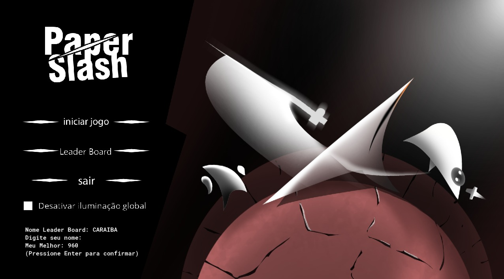

# Paper-Slash

## 🍁 Sobre o repositório
Este repositório contém a documentação e demonstração do jogo criado na disciplina de Computabilidade e Complexidade de Algoritmos - Centro Universitário do Distrito Federal, durante o 6° semestre.

## 👥 Participantes
- 👩‍🏫 Prof. Kadidja Valéria
- 👤 Lucas Albuquerque -
- 👤 Saulo Silva - 30372607
- 👤 Pedro Mateus - 299880804
- 👤 João Marcos - 30620406
- 👤 Lucio Roberto - 30153263

## 📰 Sobre o Jogo
 **Paper Slash**: é um jogo em perspectiva 2D em que o jogador controla um papel que usa uma espada para eliminar outros papéis. Existe, no jogo, um sistema de pontuação baseado na quantidade de inimigos derrotados dentro do tempo limite que é de 5 minutos. Ao finalizar uma tentativa, o jogador será colocado no sistema de ranking do jogo e conseguir uma boa posição é a forma mais clara de vitória.
 
 

## ⚙️ Tecnologias
 **Game Maker Studio**: é uma engine de criação de jogos 2D de fácil uso e aprendizado e suporta plataformas como Windows, Mac, Linux, Android, iOS e HTML5.
 
 **Game Maker Language(GML)**: é uma linguagem de programação utilizada pelo Game Maker Studio.

 **Protocolo HTTP**: Para o sistema de pontuação e ranking foi utilizado servidores de conexão em protocolo HTTP. Cada pessoa pode baixar o jogo em sua própria máquina e a pontuação será atualizada via internet no ranking global.

 **Efeitos Visuais**: Na parte gráfica do jogo foi utilizado um efeito de luz para ambientação. Essa configuração dificultou a jogabilidade em computadores menos potentes. Para solucionar esse problema foi criado uma configuração gráfica sem esse efeito de luz, possibilitando a execução do jogo em máquinas mais fracas. As duas opções gráficas estão dentro do jogo.

## ♾️ Complexidade
 **Pontuação**: pontos são adquiridos ao derrotar inimigos. Os pontos adquiridos são proporcinais à dificuldade do inimigo.
 
 **Tempo**: a partir de um tempo limite e do sistema de pontos, o jogo desafia o jogador a conseguir a maior quantidade de pontos.

 **Stamina**: existe uma mecânica de fôlego que consiste em dar um limite para as ações do jogador. Há uma quantidade específica de fôlego e todas as ações do jogador, exceto andar, gastam esse recurso. Depois de um pequeno tempo sem executar nenhuma dessa ações, a quantidade de fôlego é recuperada lentamente.

 **Vida**: ganhar ou perder depende da vida. Cada entidade do jogo possui uma quantidade diferente de vida e não foi implementada uma forma de recuperá-la, tornando-a o recurso mais importante do jogo. Os ataques diminuem a quantidade de vida das entidades (jogador e inimigos).

## 🎮 Jogabilidade
 **Movimentação**: o jogo é em perspectiva 2D com uma visão de cima. O jogador se mexe utilizando as teclas (W, A, S, D) e pode correr seguranto a tecla (SHIFT). Além disso, o jogador pode dar um dash (um movimento rápido para avançar ou escapar de um inimigo) utilizando a barra de (Espaço).
 
 **Ações**: o jogador mira os seus ataques usando o mouse e o botão esquerdo para efetuar o ataque. 
